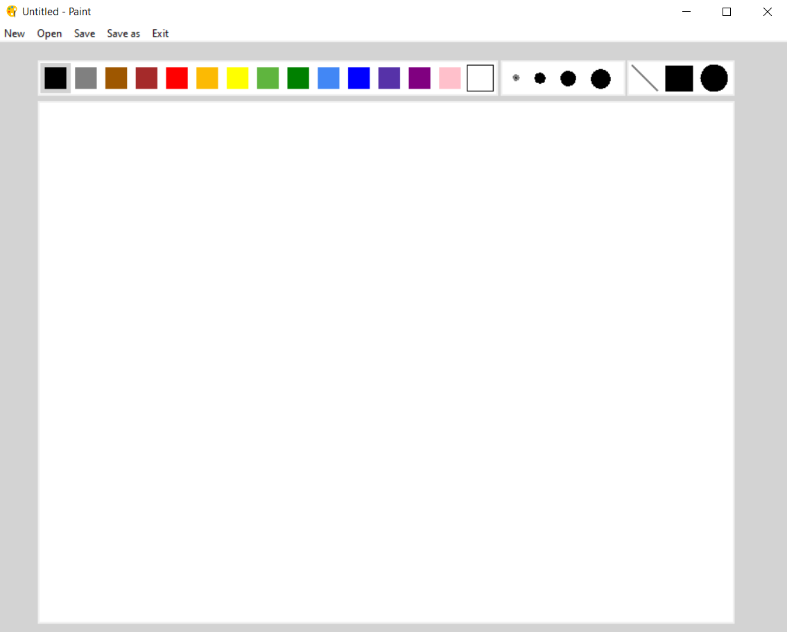
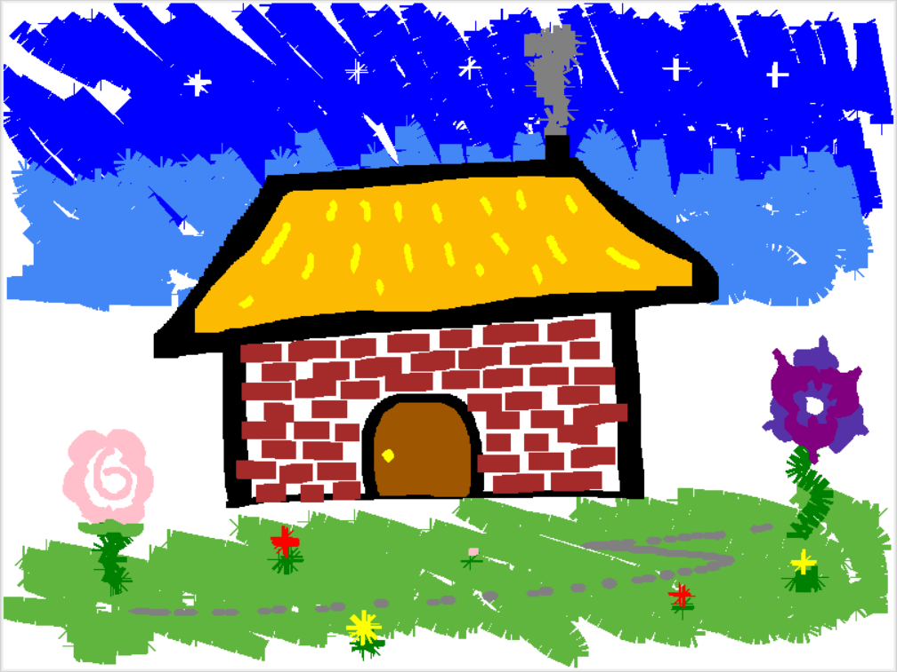

# Paint-Lite

## Description
Hello everyone and welcome to Paint Lite, a project inspired directly by the Microsoft's Paint app, well known from everybody.
I wanted to recreate an drawing application that can also work as an image/graphical editor to a very limited extent.
Here, you can choose your colors, thickness and style of your brushes, and save your works !

## Controls
### On the drawing canvas
Left click + Move the mouse to draw.
Right click to undo a stroke
### On the palettes
Above the drawing canvas are from left to right the color, thickness and brush style palettes.
Left click in the respective palette to select what you want, I hope it's pretty intuitive !
### Top bar
Above the 3 palettes are buttons for saving(as), opening or creating a new canvas, simply click on those buttons to do the intended action

## Author
Realized by Henrique D.M.M

## Demo images
### App on opening

### Create some colorful drawings ! 

